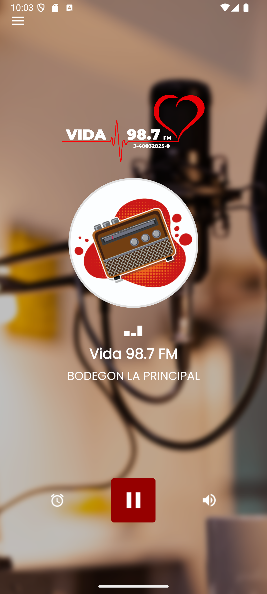

# VIDA 98.7 FM App

Aplicación Android para escuchar en streaming la emisora VIDA 98.7 FM con una interfaz moderna y funcionalidades adicionales para mejorar la experiencia de usuario.

## Características

- **Transmisión en vivo**: Reproducción continua del stream oficial de VIDA 98.7 FM.
- **Ecualizador integrado**: Ajusta la calidad de audio según tus preferencias.
- **Temporizador de apagado**: Programa el tiempo de reproducción antes de que la app se detenga automáticamente.
- **Interfaz limpia y moderna**: Diseñada para facilitar la navegación y el acceso rápido a controles.
- **Compatibilidad**: Soporta Android 7.0 (API 24) y superiores; optimizada para las últimas versiones (Android 15).
- **Compartir en redes sociales**: Comparte lo que estás escuchando desde la interfaz.
- **Actualización automática**: Soporte para actualización vía Google Play Store o descarga de APK desde GitHub Releases.
- **Notificaciones**: Control de reproducción desde barra de notificaciones.

## Capturas de pantalla

## Instalación

La aplicación proximamente estara disponible en Google Play Store:

Alternativamente, puedes descargar el APK desde la sección de Releases de este repositorio.

> **Nota**: Este repositorio no contiene el código fuente de la aplicación; solo la documentación pública. El APK se provee en Releases si corresponde.

## Uso rápido

1. Abre la app.
2. Toca el botón de reproducir para iniciar la transmisión.
3. En Ajustes, programa el temporizador de apagado según tu preferencia.
4. Usa el botón de compartir para publicar en tus redes sociales.

## Requisitos

- Dispositivo con Android 7.0 o superior.
- Conexión a internet para streaming.

## Historial de versiones - App Android

- **v1.3.1** (15 Jun 2025): Mejoras de compatibilidad con Android 15 y correcciones de estabilidad.
- **v1.3.0**: Implementación de sistema de actualización dual (Play Store / GitHub Releases) y mejoras en la pantalla de actualización.
- **v1.2.1**: Actualización de dependencias para reforzar seguridad interna.
- **v1.2.0**: Eliminación de funcionalidad de publicidad.
- (Versiones previas…)  

> Este changelog es un resumen de los cambios percibidos. Para detalles técnicos, contacte al equipo de desarrollo.

## Historial de versiones - Web

- **v1.0.3** (26 Jul 2024): Revisión y ajustes de responsive en `index.astro`. Se mejoró la visualización de la navegación principal en dispositivos móviles.
- **v1.0.2** (19 Jun 2025): Implementación de contador dinámico de descargas para el APK desde GitHub Releases.
- **v1.0.1** (18 Jun 2025): Eliminación de CSS no utilizado en la página de inicio (`index.astro`) para optimizar la carga.

## Próximas mejoras

- UI edge-to-edge y soporte para modos oscuros/temas adaptativos.
- Posible buffer avanzado.
- Integración de nuevas funciones según feedback de usuarios.

## Cómo contribuir

Actualmente este repositorio no acepta contribuciones de código (código fuente privado). Si deseas enviar sugerencias, reportar bugs o proponer funcionalidades, abre un issue o contacta a [correo o enlace de feedback].

## Licencia

Este repositorio contiene documentación pública. El código fuente de la aplicación no está disponible aquí.  
La aplicación distribuida (APK) está sujeta a los términos de la Play Store y licencias de terceros incluidos en el binario.  
Si en el futuro se libera código, se especificará una licencia adecuada (p.ej. MIT, Apache 2.0).

## Contacto

Para consultas o soporte:
- Correo: soporte@vida987.com
- Instagram / redes: @emisoravida98.7
- Sitio web: https://vida987.com

